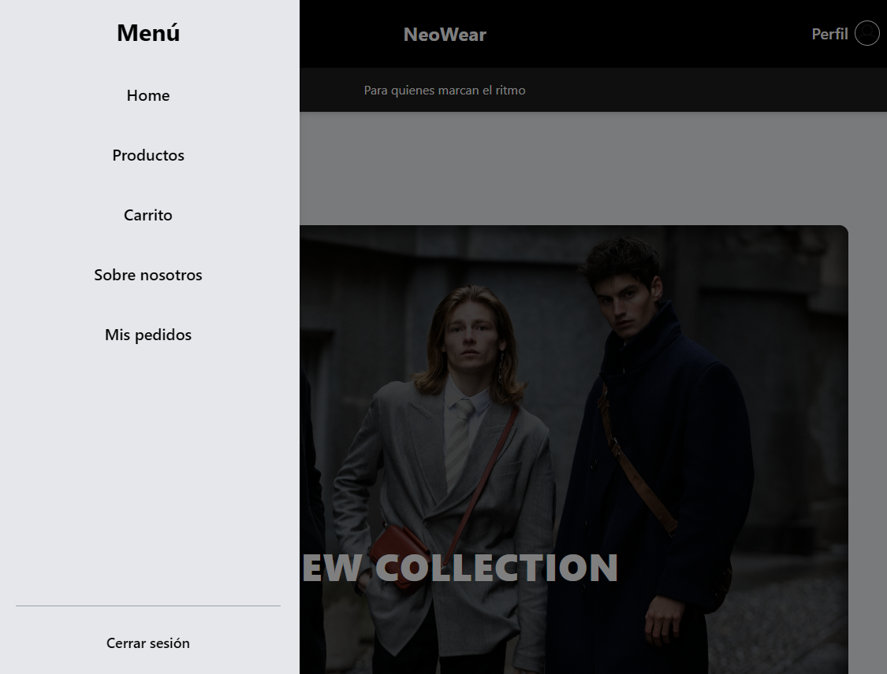
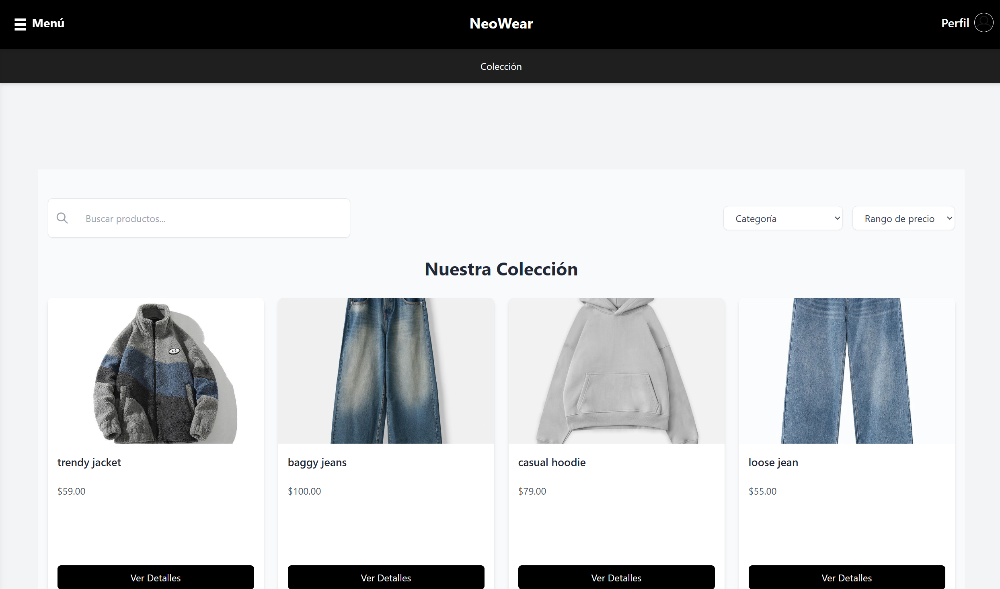
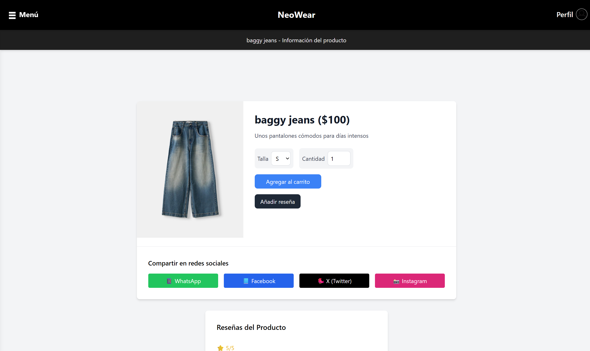
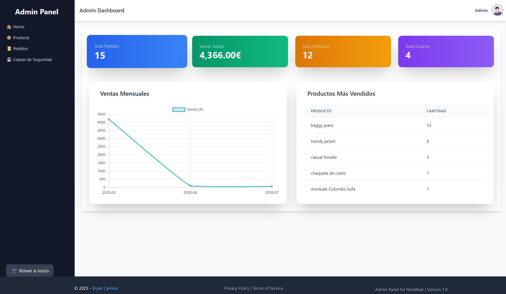

# Neowear - Plataforma E-commerce

 <!-- opcional, si tienes logo -->

---

# Preview






## 🚀 Descripción

**Neowear** es una plataforma de comercio electrónico moderna, intuitiva y segura que ofrece una experiencia de compra fluida y atractiva. Está diseñada para cubrir todas las necesidades de un e-commerce profesional, incluyendo:

-   Pagos integrados mediante **PayPal**.
-   Carrusel interactivo en la página de inicio para destacar productos y promociones.
-   Panel de administración robusto para la gestión completa del catálogo y pedidos.
-   Perfiles de usuario personalizados con historial de compras y gestión de información.
-   Diseño responsivo y atractivo gracias a **TailwindCSS** y **JavaScript**.

---

## 💻 Tecnologías utilizadas

-   **Laravel** – Framework PHP para backend y arquitectura MVC.
-   **MySQL** – Base de datos relacional para almacenamiento seguro y eficiente.
-   **TailwindCSS** – Framework CSS para estilos rápidos y personalizados.
-   **JavaScript** – Interactividad y comportamiento dinámico en el frontend.
-   **HTML5** – Estructura semántica y accesible para el sitio web.

---

## 🎯 Funcionalidades principales

-   **Gestión de usuarios**: Registro, login, edición de perfil y recuperación de contraseña.
-   **Catálogo de productos**: Navegación por categorías, filtros y búsquedas.
-   **Carrito y pedidos**: Añadir, modificar y eliminar productos; confirmación y seguimiento de pedidos.
-   **Pago seguro**: Integración con PayPal para transacciones fiables.
-   **Panel de administración**: Control total sobre productos, pedidos, usuarios y estadísticas.
-   **Diseño responsive**: Compatible con dispositivos móviles, tablets y escritorio.

---

## 📦 Instalación

1. Clona el repositorio:
    ```bash
    git clone https://github.com/bryancarrion19/Neowear.git
    cd Neowear
    ```
2. Instala dependencias:
    ```bash
    composer install
    npm install
    npm run dev
    ```
3. Configura el archivo **.env** con tus credenciales de base de datos, paypal y smtp
4. Genera la clave de aplicación:
    ```bash
    php artisan key:generate
    ```
5. Ejecuta migraciones y seeders:
    ```bash
    php artisan migrate --seed
    ```
6. Inicia el servidor local:
    ```bash
    php artisan serve
    ```

## 🤝 Contribuciones
¡Las contribuciones son bienvenidas! Por favor abre un issue o un pull request para sugerir mejoras o reportar errores.
 
